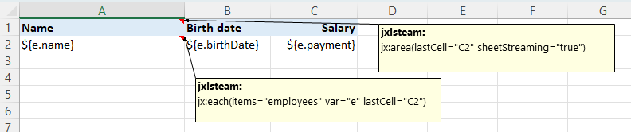
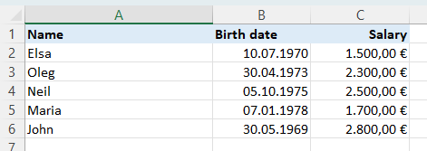

# xlfill

A template-first Excel filling library for Go. Design your `.xlsx` templates in any spreadsheet editor, annotate cells with `jx:` commands, and fill them with data from your Go application.

Inspired by [JXLS 3.0](https://jxls.sourceforge.net/) — ported to idiomatic Go.

[](https://pkg.go.dev/github.com/javajack/xlfill)
[](https://opensource.org/licenses/MIT)

## The Idea

You design your report in Excel — fonts, colors, borders, number formats — then XLFill fills it with data. No styling code. The template *is* the design.

**Here's a template you'd design:**



Put `${e.Name}`, `${e.Age}`, `${e.Payment}` in cells. Add a `jx:each(...)` command in a cell comment. That's it.

**And here's what XLFill produces:**



Same fonts. Same colors. Same borders. You didn't write a single line of code for any of that styling.

## Install

```bash
go get github.com/javajack/xlfill
```

## Quick Start

```go
package main

import "github.com/javajack/xlfill"

func main() {
    data := map[string]any{
        "employees": []map[string]any{
            {"Name": "Alice", "Age": 30, "Department": "Engineering"},
            {"Name": "Bob", "Age": 25, "Department": "Marketing"},
            {"Name": "Carol", "Age": 35, "Department": "Engineering"},
        },
    }

    err := xlfill.Fill("template.xlsx", "output.xlsx", data)
    if err != nil {
        panic(err)
    }
}
```

One function call. All template formatting preserved.

## Template Syntax

### Expressions

Expressions are enclosed in `${...}` and placed directly in cell values:

```
${employee.Name}        // field access
${price * quantity}     // arithmetic
${items[0].Name}        // indexing
${age > 18 ? "Y" : "N"} // ternary
```

Powered by [expr-lang/expr](https://github.com/expr-lang/expr) — see its docs for full expression syntax.

### Commands

Commands are placed in **cell comments** using the `jx:` prefix. Multiple commands in one cell are separated by newlines.

#### jx:area

Defines the working region of the template. Required as the outermost command.

```
jx:area(lastCell="D10")
```

#### jx:each

Iterates over a collection, repeating the template area for each item.

```
jx:each(items="employees" var="e" lastCell="C1")
```

| Attribute   | Description                                      | Default |
|-------------|--------------------------------------------------|---------|
| `items`     | Expression for the collection to iterate         | required |
| `var`       | Loop variable name                               | required |
| `lastCell`  | Bottom-right cell of the repeating area          | required |
| `varIndex`  | Variable name for the 0-based iteration index    | —       |
| `direction` | Expansion direction: `DOWN` or `RIGHT`           | `DOWN`  |
| `select`    | Filter expression (must return bool)             | —       |
| `orderBy`   | Sort spec: `"e.Name ASC, e.Age DESC"`            | —       |
| `groupBy`   | Property to group by (creates `GroupData` items)  | —       |
| `groupOrder`| Group sort order: `ASC` or `DESC`                | `ASC`   |
| `multisheet`| Context variable with sheet names (one sheet per item) | —  |

**GroupData** fields when using `groupBy`:
- `Item` — the group key value
- `Items` — slice of items in the group

**Multisheet mode**: When `multisheet` is set, each item in the collection gets its own worksheet. The template sheet is copied for each item and then deleted.

```
jx:each(items="departments" var="dept" multisheet="sheetNames" lastCell="C5")
```

**Nested commands**: Commands can be nested inside each other. An inner `jx:each` or `jx:if` whose area is strictly within an outer command's area will be processed as a child. This enables hierarchical templates like departments → employees.

#### jx:if

Conditionally includes or excludes a template area.

```
jx:if(condition="e.Age >= 18" lastCell="C1")
```

| Attribute   | Description                                      |
|-------------|--------------------------------------------------|
| `condition` | Boolean expression                               |
| `lastCell`  | Bottom-right cell of the conditional area        |
| `ifArea`    | Area ref to render when true (advanced)          |
| `elseArea`  | Area ref to render when false (advanced)         |

#### jx:grid

Fills a grid with headers in one direction and data in another.

```
jx:grid(headers="headerList" data="dataRows" lastCell="A1")
```

| Attribute  | Description                                       |
|------------|---------------------------------------------------|
| `headers`  | Expression for header values (1D slice)           |
| `data`     | Expression for data rows (2D slice)               |
| `lastCell` | Bottom-right cell of the grid area                |

#### jx:image

Inserts an image from byte data.

```
jx:image(src="employee.Photo" imageType="PNG" lastCell="C5")
```

| Attribute   | Description                                      |
|-------------|--------------------------------------------------|
| `src`       | Expression for image bytes (`[]byte`)            |
| `imageType` | Image format: `PNG`, `JPEG`, `GIF`, etc.         |
| `lastCell`  | Bottom-right cell defining the image area        |
| `scaleX`    | Horizontal scale factor (default: 1.0)           |
| `scaleY`    | Vertical scale factor (default: 1.0)             |

#### jx:mergeCells

Merges cells in the specified area.

```
jx:mergeCells(lastCell="C1" cols="3" rows="1")
```

#### jx:updateCell

Updates a single cell's value using an expression.

```
jx:updateCell(lastCell="A1" updater="totalAmount")
```

#### jx:autoRowHeight

Auto-fits row height after content is written. Useful when cells contain wrapped text.

```
jx:autoRowHeight(lastCell="C1")
```

#### jx:repeat

Repeats an area N times without needing a collection. Perfect for blank invoice lines and padding.

```
jx:repeat(count="10" var="i" lastCell="C1")
```

| Attribute   | Description                                      | Default |
|-------------|--------------------------------------------------|---------|
| `count`     | Number of repetitions (expression or literal)    | required |
| `var`       | 0-based iteration index variable name            | —       |
| `direction` | Expansion direction: `DOWN` or `RIGHT`           | `DOWN`  |
| `lastCell`  | Bottom-right cell of the area to repeat          | required |

#### jx:table

Creates a structured Excel table with auto-filter, banded rows, and optional total row.

```
jx:table(lastCell="D1" name="EmployeeTable" style="TableStyleMedium9")
```

#### jx:chart

Embeds Excel charts (bar, line, pie, doughnut, area, scatter, radar) with auto-sized data ranges.

```
jx:chart(lastCell="H15" type="bar" title="Revenue" catRange="A2:A2" valRange="B2:B2")
```

#### jx:sparkline

Adds mini in-cell charts (line, column, win/loss) alongside your data rows.

```
jx:sparkline(lastCell="E1" type="line" dataRange="B1:D1")
```

#### jx:conditionalFormat

Applies data bars, color scales, icon sets, and cell highlighting rules.

```
jx:conditionalFormat(lastCell="B1" type="dataBar" minColor="#638EC6" maxColor="#638EC6")
jx:conditionalFormat(lastCell="C1" type="colorScale" minColor="#F8696B" midColor="#FFEB84" maxColor="#63BE7B")
jx:conditionalFormat(lastCell="D1" type="iconSet" iconStyle="3Arrows")
```

#### jx:dataValidation

Adds dropdown lists, integer/decimal constraints, and input messages to cells.

```
jx:dataValidation(lastCell="B1" type="list" formula1="choices" allowBlank="true")
jx:dataValidation(lastCell="C1" type="whole" operator="between" formula1="1" formula2="100")
```

#### jx:definedName

Creates named ranges for formulas, pivot tables, and cross-sheet references.

```
jx:definedName(lastCell="D1" name="SalesData")
```

#### jx:group

Creates collapsible outline groups for hierarchical reports.

```
jx:group(lastCell="D1" collapsed="false")
```

#### jx:pageBreak

Inserts page breaks for print-ready reports.

```
jx:pageBreak(lastCell="D1")
```

#### jx:autoColWidth

Auto-fits column widths to content after processing.

```
jx:autoColWidth(lastCell="D1")
```

#### jx:freezePanes

Freezes rows and/or columns so headers stay visible while scrolling.

```
jx:freezePanes(lastCell="A1" row="1" col="0")
```

#### jx:protect

Protects sheets from editing with configurable permissions.

```
jx:protect(lastCell="A1" password="secret" sort="true" autoFilter="true")
```

#### jx:include

Composes templates from reusable fragments (shared headers, footers, etc.).

```
jx:include(lastCell="D3" area="Header!A1:D3")
```

## API

### Top-Level Functions

```go
// Fill a template file, write to output file
xlfill.Fill(templatePath, outputPath string, data map[string]any, opts ...Option) error

// Fill a template file, return bytes
xlfill.FillBytes(templatePath string, data map[string]any, opts ...Option) ([]byte, error)

// Fill from io.Reader, write to io.Writer
xlfill.FillReader(template io.Reader, output io.Writer, data map[string]any, opts ...Option) error

// Pre-compile a template for repeated fills (batch generation, API endpoints)
compiled, err := xlfill.Compile("template.xlsx", opts...)
compiled.Fill(data, "output.xlsx")       // reuse — no file I/O
compiled.FillBytes(data)                  // returns []byte

// Validate template data contract before processing
issues, err := xlfill.ValidateData("template.xlsx", data)

// Auto-detect optimal processing mode
suggestion, err := xlfill.SuggestMode("template.xlsx", map[string]any{"itemCount": 50000})

// Batch generation from compiled template
compiled, _ := xlfill.Compile("template.xlsx")
compiled.FillBatch(datasets, "./reports/", func(i int, d map[string]any) string {
    return fmt.Sprintf("report_%s.xlsx", d["month"])
})

// Serve Excel reports from HTTP endpoint
http.Handle("/report", xlfill.HTTPHandler("template.xlsx",
    func(r *http.Request) (map[string]any, error) {
        return loadData(r), nil
    },
))

// Data helpers — convert structs, JSON, or SQL rows to data maps
data := xlfill.StructSliceToData("employees", employees)
data, _ := xlfill.JSONToData(jsonBytes)
data, _ := xlfill.SQLRowsToData("employees", rows)
```

### Filler (Advanced)

For more control, create a `Filler` directly:

```go
filler := xlfill.NewFiller(
    xlfill.WithTemplate("template.xlsx"),
    xlfill.WithClearTemplateCells(true),
)
err := filler.Fill(data, "output.xlsx")
```

### Options

| Option                        | Description                                          |
|-------------------------------|------------------------------------------------------|
| `WithTemplate(path)`          | Set template file path                               |
| `WithTemplateReader(r)`       | Set template as `io.Reader`                          |
| `WithExpressionNotation(b,e)` | Custom expression delimiters (default: `${`, `}`)    |
| `WithCommand(name, factory)`  | Register a custom command                            |
| `WithFunction(name, fn)`      | Register a custom expression function                |
| `WithI18n(translations)`      | Provide translation map for the `t()` function       |
| `WithClearTemplateCells(bool)` | Clear unexpanded template cells (default: true)      |
| `WithKeepTemplateSheet(bool)` | Keep original template sheet in output               |
| `WithHideTemplateSheet(bool)` | Hide template sheet instead of deleting              |
| `WithRecalculateOnOpen(bool)` | Tell Excel to recalculate all formulas on open       |
| `WithAreaListener(listener)`  | Add a before/after cell transform hook               |
| `WithPreWrite(fn)`            | Callback before writing output                       |
| `WithStreaming(bool)`         | **3x faster, 60% less memory** — streaming output    |
| `WithParallelism(n)`          | Concurrent `jx:each` with N goroutines               |
| `WithAutoMode(hint)`          | Auto-select optimal mode from template analysis      |
| `WithContext(ctx)`             | `context.Context` for cancellation and timeouts      |
| `WithProgressFunc(fn)`        | Progress callback with rows processed and timing     |
| `WithStrictMode(bool)`        | Turn unknown command warnings into errors            |
| `WithDebugWriter(w)`          | Structured trace output during processing            |
| `WithStreamingSheets(sheets...)`| Enable streaming only for specific sheets          |
| `WithDocumentProperties(props)` | Set workbook metadata (title, author, etc.)        |

## Custom Commands

Implement the `Command` interface and register with `WithCommand`:

```go
type Command interface {
    Name() string
    ApplyAt(cellRef CellRef, ctx *Context, transformer Transformer) (Size, error)
    Reset()
}

// Register
filler := xlfill.NewFiller(
    xlfill.WithTemplate("template.xlsx"),
    xlfill.WithCommand("highlight", func(attrs map[string]string) (xlfill.Command, error) {
        return &HighlightCommand{Color: attrs["color"]}, nil
    }),
)
```

Then use in templates: `jx:highlight(color="yellow" lastCell="C1")`

## Built-in Functions

XLFill ships with 16 built-in functions available in all `${...}` expressions:

| Function | Example | Description |
|----------|---------|-------------|
| `hyperlink(url, display)` | `${hyperlink(e.URL, e.Name)}` | Create a clickable hyperlink |
| `comment(text)` | `${comment(e.Notes)}` | Add a cell comment/note |
| `upper(s)` | `${upper(e.Name)}` | Convert to uppercase |
| `lower(s)` | `${lower(e.Email)}` | Convert to lowercase |
| `title(s)` | `${title(e.Name)}` | Convert to title case |
| `join(sep, items)` | `${join(", ", e.Skills)}` | Join a slice into a string |
| `formatNumber(val, fmt)` | `${formatNumber(e.Salary, "#,##0.00")}` | Format a number |
| `formatDate(val, layout)` | `${formatDate(e.Hire, "2006-01-02")}` | Format a date/time |
| `coalesce(values...)` | `${coalesce(e.Nick, e.Name, "N/A")}` | First non-empty value |
| `ifEmpty(val, fallback)` | `${ifEmpty(e.Dept, "Unassigned")}` | Fallback for empty values |
| `sumBy(items, field)` | `${sumBy(employees, "Salary")}` | Sum a numeric field |
| `avgBy(items, field)` | `${avgBy(employees, "Salary")}` | Average a numeric field |
| `countBy(items, field)` | `${countBy(employees, "Email")}` | Count non-nil values |
| `minBy(items, field)` | `${minBy(scores, "Value")}` | Minimum of a numeric field |
| `maxBy(items, field)` | `${maxBy(scores, "Value")}` | Maximum of a numeric field |
| `t(key)` | `${t("header.name")}` | Translate using i18n map |

Register custom functions with `WithFunction("name", fn)`. See the full [Built-in Functions guide](https://javajack.github.io/xlfill/guides/built-in-functions/).

## Built-in Variables

These variables are automatically available in every cell expression:

| Variable | Description                          |
|----------|--------------------------------------|
| `_row`   | Current output row number (1-based)  |
| `_col`   | Current output column index (0-based)|

```
Row ${_row}: ${e.Name}
```

## Area Listeners

Listeners let you hook into cell transformation for conditional styling, logging, or validation:

```go
type AreaListener interface {
    BeforeTransformCell(src, target CellRef, ctx *Context, tx Transformer) bool
    AfterTransformCell(src, target CellRef, ctx *Context, tx Transformer)
}
```

Return `false` from `BeforeTransformCell` to skip the default transformation for that cell.

```go
xlfill.Fill("template.xlsx", "output.xlsx", data,
    xlfill.WithAreaListener(myListener),
)
```

## Formula Support

Formulas in template cells are automatically updated when rows/columns are inserted during expansion. For example, `=SUM(B1:B1)` in a template will expand to `=SUM(B1:B5)` when 5 data rows are generated.

### Parameterized Formulas

Formulas can contain `${...}` expressions that are resolved from context data before writing:

```
=A1*${taxRate}        → =A1*0.2
=A1*${rate}+${bonus}  → =A1*0.1+500
```

## Template Validation & Debugging

Catch template issues before runtime — no data required:

```go
// Validate expressions, command attributes, and bounds
issues, err := xlfill.Validate("template.xlsx")
for _, issue := range issues {
    fmt.Println(issue) // [ERROR] Sheet1!B2: invalid expression syntax "e.Name +": ...
}

// Inspect what the engine parsed from your template
output, err := xlfill.Describe("template.xlsx")
fmt.Print(output)
// Template: template.xlsx
// Sheet1!A1:C2 area (3x2)
//   Commands:
//     Sheet1!A2 each (3x1) items="employees" var="e"
//       ...
```

See the full [Debugging & Troubleshooting](https://javajack.github.io/xlfill/guides/debugging/) guide.

## Performance

Benchmarked on Intel i5-9300H @ 2.40GHz:

| Scenario | Rows | Mode | Time | Memory | Throughput |
|----------|------|------|------|--------|------------|
| Simple template | 1,000 | Sequential | 27ms | 8.3 MB | ~37,000 rows/sec |
| Simple template | 1,000 | **Streaming** | **8.9ms** | **3.3 MB** | **~112,000 rows/sec** |
| Simple template | 10,000 | Sequential | 250ms | 75 MB | ~40,000 rows/sec |
| Nested loops (10×20) | 200 | Sequential | 2.0ms | 810 KB | ~100,000 rows/sec |
| Expression eval | 1 | — | 182ns | 48 B | ~5.5M evals/sec |

Streaming mode: **3x faster, 60% less memory**. Enable with `WithStreaming(true)` or let `WithAutoMode` pick it automatically. See the full [Performance Tuning](https://javajack.github.io/xlfill/guides/performance-tuning/) guide.

## Documentation

Full documentation with guides, examples, and API reference:

**[javajack.github.io/xlfill](https://javajack.github.io/xlfill/)**

- [Getting Started](https://javajack.github.io/xlfill/guides/getting-started/) — build your first template in 5 minutes
- [19 Runnable Examples](https://javajack.github.io/xlfill/reference/examples/) — every feature with downloadable templates
- [API Reference](https://javajack.github.io/xlfill/reference/api/) — complete function, option, and type reference
- [Debugging & Troubleshooting](https://javajack.github.io/xlfill/guides/debugging/) — Validate, Describe, and common fixes

## Requirements

- Go 1.24+
- Only `.xlsx` files are supported

## Credits

- [JXLS](https://jxls.sourceforge.net/) by Leonid Vysochyn — the Java Excel template engine that inspired XLFill's template-first approach
- [excelize](https://github.com/qax-os/excelize) by Ri Xu — the Go Excel library that powers XLFill under the hood
- [expr-lang](https://github.com/expr-lang/expr) — the expression evaluation engine

## License

MIT
